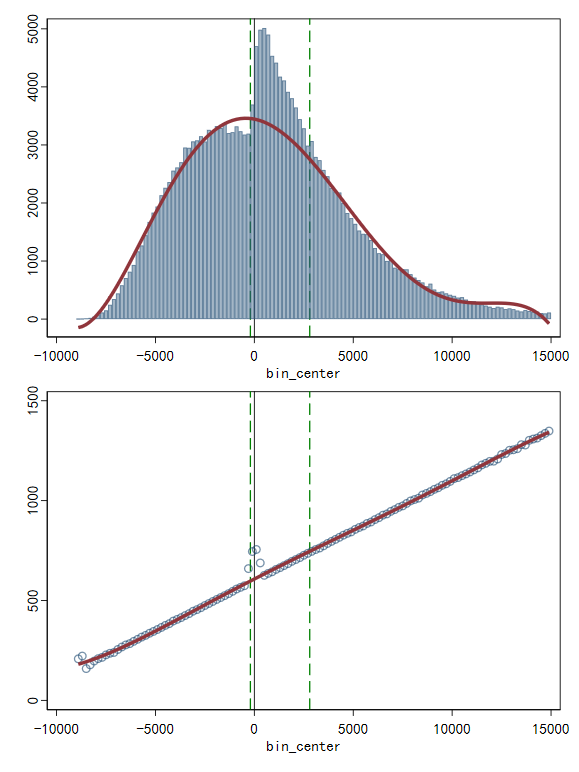
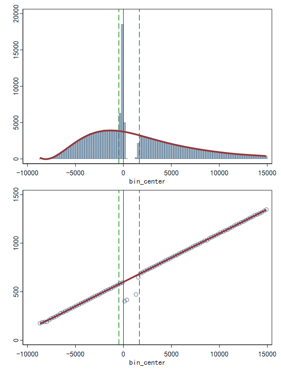
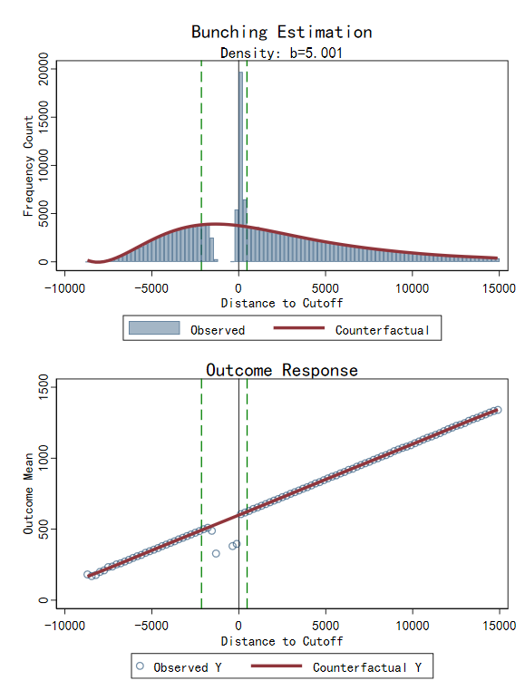

`fbunch` 是一个用于估计政策断点处群聚效应 (Bunching Estimation) 的综合性 Stata 命令。它支持 Kink（拐点）和 Notch（断层）模型，通过构建反事实分布来量化个体对税收、补贴、规制等政策的行为反应。

与传统依赖人为指定参数的方法不同，`fbunch` 采用 **完全数据驱动 (Data-driven)** 与 **联合判定 (Joint Determination)** 算法，自动选择最优参数，确保了估计结果的稳健性、客观性和可复现性。

## 主要功能 (Features)

- **完全数据驱动**：不再依赖主观判断，自动选择最优的分箱宽度 (Bin Width)、多项式阶数 (Degree) 和排除窗口 (Excluded Window)。
- **联合判定算法**：采用严谨的双重迭代逻辑，**同时**确定最优的多项式阶数和窗口范围，解决了阶数与窗口选择的内生性问题。
- **积分约束与平衡 (Integration Constraint)**：
  - **Kink**：支持 **Chetty-style Balance** 调整，通过迭代平移反事实分布以满足总人数守恒，并报告 **Adjustment Factor** (调整幅度)。
  - **Notch**：支持 **B=M 约束** 的全局搜索求解，自动寻找使群聚量等于缺失量的最优窗口。
- **因果推断**：支持 **结果变量 (Outcome Response)** 分析，估算其他经济变量（如工时、税负、合规度）在断点处的**平均因果变化**。
- **严谨推断**：支持 **Residual Bootstrap**，自动计算密度群聚量、调整系数和结果变量效应的标准误。

## 安装方法 (Installation)

您可以直接通过 Stata 从 GitHub 安装此命令：

```stata
net install fbunch, from("https://raw.githubusercontent.com/fyapeng/fbunch/main") replace
```

或者，如果您已经下载了文件，请将 `fbunch.ado` 和 `fbunch.sthlp` 放置在您的 Stata 个人 ADO 目录中（通常是 `C:\Users\用户名\ado\personal\f\`）。

## 语法 (Syntax)

```stata
fbunch depvar, cutoff(#) [options]
```

### 核心选项说明

| 选项 | 描述 |
| :--- | :--- |
| `cutoff(#)` | **必填**。指定政策断点/阈值的数值。 |
| `width(#)` | 分箱宽度。若不指定，默认基于 Freedman-Diaconis 准则自动计算。 |
| `model(str)` | 模型类型：`kink` (默认) 或 `notch`。 |
| `side(str)` | 群聚方向：`left` (默认，如税收断点) 或 `right` (如补贴门槛)。 |
| `select(str)` | 多项式阶数选择标准：`mse` (默认), `aic`, 或 `bic`。均基于 5折交叉验证计算。 |
| `improve(#)` | 阶数选择的“肘部法则”阈值 (默认 0.05)，防止高阶过拟合。 |
| `balance(str)` | **Kink 专用**。指定 `left` 或 `right`。迭代调整反事实分布高度以满足积分约束。 |
| `constraint` | **Notch 专用**。强制执行 B=M 积分约束，通过全局搜索寻找最优窗口。 |
| `outcome(var)` | 指定一个结果变量，计算该变量在断点处的**平均因果效应**。 |
| `reps(#)` | Bootstrap 重抽样次数 (建议 500)，用于计算标准误。 |

## 统计原理 (Methods)

1.  **联合判定算法 (Joint Determination)**：
    程序采用两阶段迭代算法。在每一次尝试扩张窗口时，都会基于当前的非排除样本重新运行模型选择算法（MSE/AIC/BIC），确定当前最优的多项式阶数。窗口仅在观测值显著偏离预测值（统计显著 + 经济显著）且符合理论方向（凸起/凹陷）时才继续扩张。

2.  **积分约束 (Integration Constraint)**：
    - **Kink 模型**：采用 `balance()` 选项。由于个体的移动会导致单侧分布变低，程序会迭代地向上平移反事实分布，直到观测总人数与反事实总人数相等。程序会报告 **Adjustment Factor**，表示反事实分布被抬高的百分比（越接近 0 表示拟合越自然）。
    - **Notch 模型**：采用 `constraint` 选项。程序寻找最优的排除窗口边界，使得群聚增加量 ($B$) 与空洞减少量 ($M$) 之差最小化。

3.  **结果变量分析 (Outcome Response)**：
    为了准确衡量因果效应，程序计算群聚窗口内结果变量的观测均值与反事实均值之差：
    
    $$\Delta \bar{Y} = Avg(Y_{obs}) - Avg(Y_{cf})$$
    
    反事实均值 $Avg(Y_{cf})$ 基于多项式拟合及 Balance 调整后的权重计算，确保了估计的一致性。

## Stata 示例 (Examples)

以下示例展示了从快速上手到发表级配置的完整流程。您可以使用 `fbunch_example.do` 生成模拟数据并分析。

### 1. 右侧群聚Kink

```stata
fbunch z_kink, cutoff(10000) side(right)  width(200) select(aic) improve(0.02) outcome(y_kink) reps(500) balance(right)
```

**运行结果：**

```text
Auto-selected bin width: 200
Running Bootstrap (500 reps)...
.......... Done.

------------------------------------------------------------------------
FBUNCH Estimation Results
Model: KINK (RIGHT)                         Total Obs:       198062
------------------------------------------------------------------------
Parameters:
  Bin Width       :    200.00               Poly Deg   : 5 (aic)
  Excluded Window : [   -200.0,    2800.0]
  Balance Adjust  : right
  Adjustment Fact.:      0.00%              (SE:      1.40)
------------------------------------------------------------------------
Density Estimates:
  Excess Mass (B)   :     12102             (SE:     773.3)
  Standard b (B/h0) :     3.456             (SE:     0.227)
  Relative b (B/Sum):     26.41%            (SE:      1.73%)
------------------------------------------------------------------------
Outcome Analysis (y_kink) in Window:
  Avg Change (Y)    :    16.542             (SE:     3.681)
  Relative Impact   :      2.47%            (SE:      0.55%)
------------------------------------------------------------------------
```



### 2. 左侧群聚Notch

```stata
fbunch z_notch_L, cutoff(10000) model(notch) select(bic) reps(500) constraint outcome(y_notch_L) improve(0.02)
```

**运行结果：**

```text
Auto-selected bin width: 238.26
Running Bootstrap (500 reps)... 
.......... Done.

------------------------------------------------------------------------
FBUNCH Estimation Results
Model: NOTCH (LEFT)                         Total Obs:       190350
------------------------------------------------------------------------
Parameters:
  Bin Width       :    238.26               Poly Deg   : 7 (bic)
  Excluded Window : [   -476.5,    1667.8]
  Constraint      : On (B=M)
------------------------------------------------------------------------
Density Estimates:
  Excess Mass (B)   :     17231             (SE:      86.3)
  Standard b (B/h0) :     4.595             (SE:     0.023)
  Relative b (B/Sum):    226.75%            (SE:      1.14%)
  Net Balance (B-M) :        40             (SE:     231.6)
  H0: B=M (p-value) :     0.861             (Not Reject H0)
------------------------------------------------------------------------
Outcome Analysis (y_notch_L) in Window:
  Avg Change (Y)    :   -63.343             (SE:     0.965)
  Relative Impact   :    -10.09%            (SE:      0.15%)
------------------------------------------------------------------------
```



### 3. 右侧群聚Notch

```stata
fbunch z_notch_R, cutoff(10000) model(notch) select(mse) side(right) constraint outcome(y_notch_R) reps(500)
```

**运行结果：**

```text
Auto-selected bin width: 238.4
Running Bootstrap (500 reps)... 
.......... Done.

------------------------------------------------------------------------
FBUNCH Estimation Results
Model: NOTCH (RIGHT)                        Total Obs:       190359
------------------------------------------------------------------------
Parameters:
  Bin Width       :    238.40               Poly Deg   : 7 (mse)
  Excluded Window : [  -2145.6,     476.8]
  Constraint      : On (B=M)
------------------------------------------------------------------------
Density Estimates:
  Excess Mass (B)   :     18776             (SE:      81.5)
  Standard b (B/h0) :     5.001             (SE:     0.022)
  Relative b (B/Sum):    253.87%            (SE:      1.10%)
  Net Balance (B-M) :        27             (SE:     259.1)
  H0: B=M (p-value) :     0.917             (Not Reject H0)
------------------------------------------------------------------------
Outcome Analysis (y_notch_R) in Window:
  Avg Change (Y)    :    -4.109             (SE:     1.140)
  Relative Impact   :     -0.74%            (SE:      0.20%)
------------------------------------------------------------------------
```



## 参考文献 (References)

本命令的算法实现基于以下经典文献及最新方法论：

- **Bosch, N., Dekker, V., & Strohmaier, K. (2020).** "A data-driven procedure to determine the bunching window." *International Tax and Public Finance*.
- **Chetty, R., et al. (2011).** "Adjustment Costs, Firm Responses, and Micro vs. Macro Labor Supply Elasticities." *The Quarterly Journal of Economics*.
- **Kleven, H. J. (2016).** "Bunching." *Annual Review of Economics*
- **Kleven, H. J., & Waseem, M. (2013).** "Using Notches to Uncover Optimization Frictions and Structural Elasticities." *The Quarterly Journal of Economics*.

## 作者 (Author)

**Easton Y. Fu**  
Email: easton.y.fu@gmail.com

---
*© 2025 Easton. All Rights Reserved.*
```
